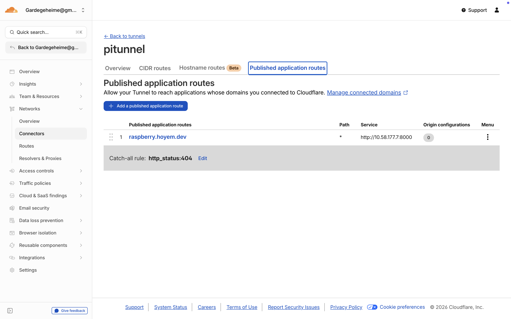

# satisfactorymodmanager

(raspberry pi) navnet er urelevant.

# prosess/logg
## Mandag Feb 23 2026
Jeg startet ved å koble opp raspberry pien. 
Flasha raspberry pi os lite over på pien (ubuntu, ingen ui)
Deretter koblet jeg meg opp på git og lagde denne repoen for å synce filer mellom maskinene.

Litt senere klarte jeg å få hosta en liten hardware monitor for raspberry pien på web via im-nettet fra pien.

## Tirsdag Feb 24 2026
I dag jobbet jeg mest på det å få stylet siden, og startet på en graph viewer for hardware statsa.

## Onsdag Feb 25 2026
I dag startet jeg med å få siden opp igjennom domenet mitt på cloudflare.
For dette brukte jeg cloudflare zero trust, og lagde en tunnel fra domenet med et subdomain til hosten (10.58.177.7:8000).
[raspberry.hoyem.dev](https://raspberry.hoyem.dev/)

