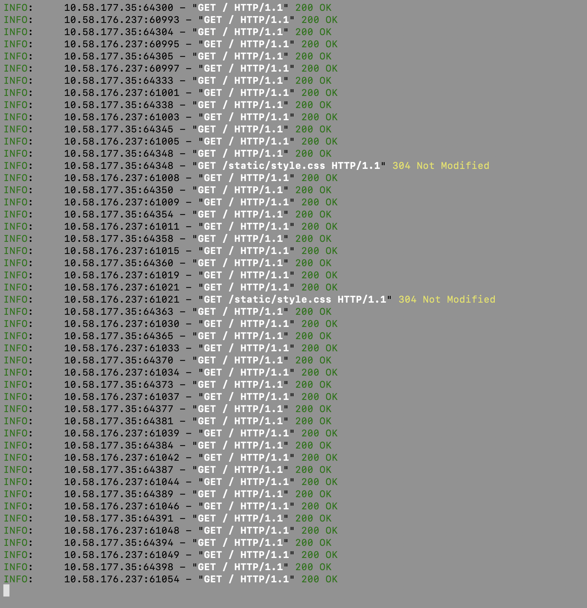
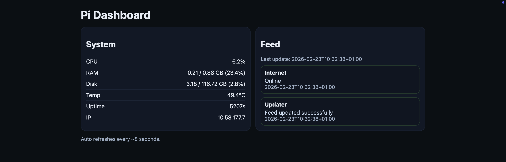
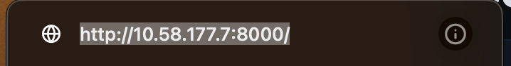

# satisfactorymodmanager

(raspberry pi) navnet er urelevant.

# prosess/logg
## Mandag Feb 23 2026
Jeg startet ved å koble opp raspberry pien. 
Flasha raspberry pi os lite over på pien (ubuntu, ingen ui)
Deretter koblet jeg meg opp på git og lagde denne repoen for å synce filer mellom maskinene.

Litt senere klarte jeg å få hosta en liten hardware monitor for raspberry pien på web via im-nettet fra pien.

